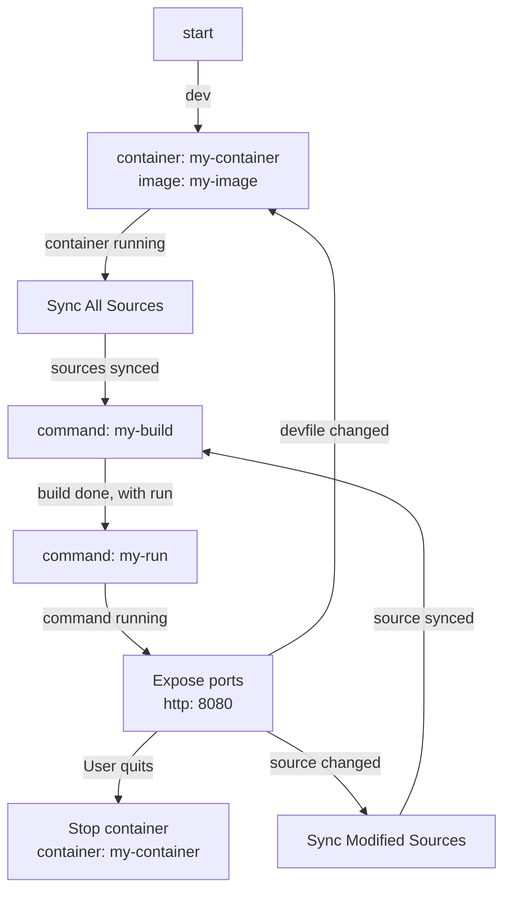

# Devfile lifecycle

The purpose of this tool is to analyze a [Devfile](https://devfile.io/) and determine its lifecycle.

The first iteration of the tool is focusing on building a graphical representation of the lifecycle of a Devfile.

This is  a work in progress and all Devfile features are not supported yet. Please explore examples below to check which features are supported.

For example, for a Devfile [container-build-run.yaml](./tests/devfiles/container-build-run.yaml) defining a single component and two commands, *build* and *run*, the lifecycle is represented as follows:



The output of the command is in text format, using the Mermaid standard. This output can be exploited by Mermaid-compatible tools (GitHub pages, IDEs, inline vizualizers) to obtain a graphical representation.

## Usage

```bash
# From a file on disk
$ go run main.go path/to/my/devfile.yaml > devfile.md

# From a Devfile Registry (don't forget trailing /)
$ go run main.go https://registry.devfile.io/devfiles/nodejs-basic/ > nodejs-basic.md
```

## Examples

Examples are visible in the [tests/graphs directory](./tests/graphs), with corresponding Devfile sources in [tests/devfiles directory](./tests/devfiles).


## Next steps

The next iteration of the tool would be to develop a library (at least in Go) providing a state-machine based on the Devfile, usable by tools working with Devfiles.
