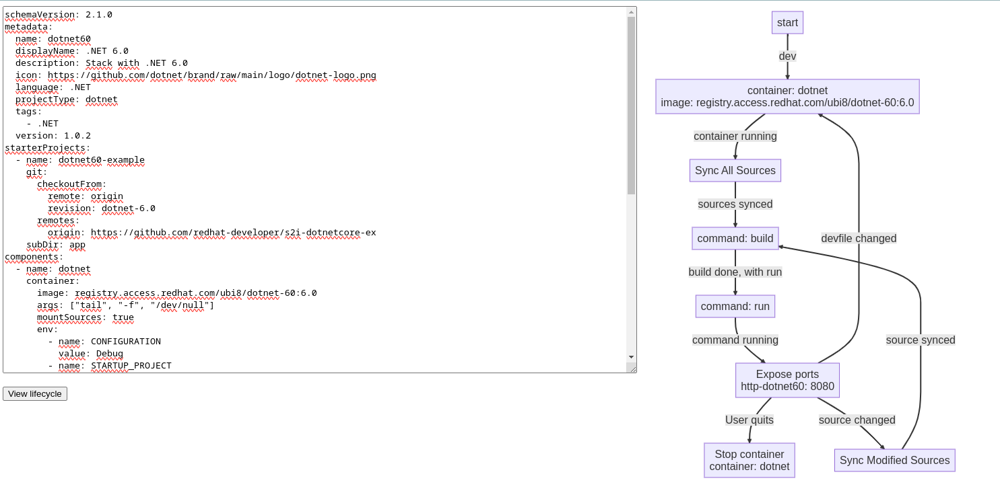

# Web Demo 

This demo uses the devfile-lifecyle library (thanks to WebAssembly) to build a graph from a Devfile content, and display it on a webpage.

Usage:

```shell
$ GOOS=js GOARCH=wasm go build -o devfile.wasm && python -m http.server
```

Then visit localhost:8000, enter a Devfile content into the textarea. The graph should be displayed on the right.

