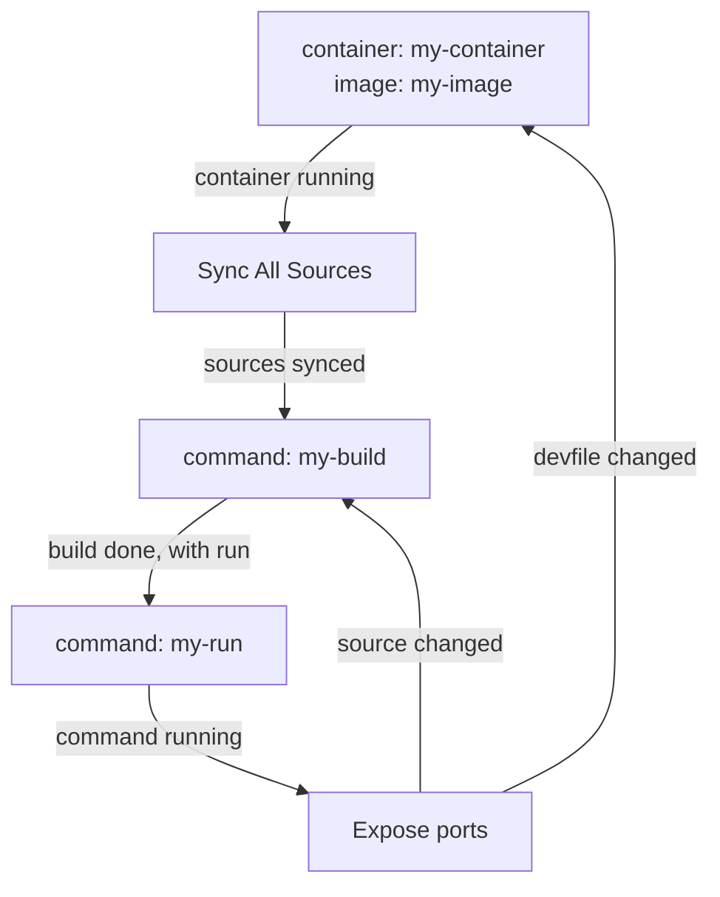

```mermaid
graph TB
my-container["container: my-container<br/>image: my-image"]
my-build["command: my-build"]
my-container-my-run-expose["Expose ports"]
my-run["command: my-run"]
sync-all-my-container["Sync All Sources"]
my-container -->|"container running"| sync-all-my-container
sync-all-my-container -->|"sources synced"| my-build
my-build -->|"build done, with run"| my-run
my-run -->|"command running"| my-container-my-run-expose
my-container-my-run-expose -->|"source changed"| my-build
my-container-my-run-expose -->|"devfile changed"| my-container
```
