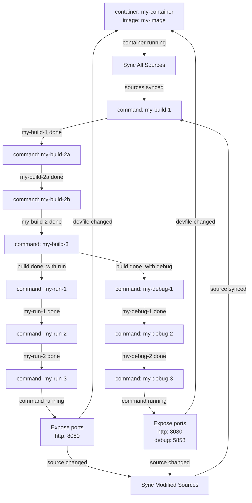

```mermaid
graph TB
my-container["container: my-container<br/>image: my-image"]
my-build-1["command: my-build-1"]
my-build-2a["command: my-build-2a"]
my-build-2b["command: my-build-2b"]
my-build-3["command: my-build-3"]
my-container-my-debug-1-expose["Expose ports<br/>http: 8080<br/>debug: 5858"]
my-container-my-run-1-expose["Expose ports<br/>http: 8080"]
my-debug-1["command: my-debug-1"]
my-debug-2["command: my-debug-2"]
my-debug-3["command: my-debug-3"]
my-run-1["command: my-run-1"]
my-run-2["command: my-run-2"]
my-run-3["command: my-run-3"]
sync-all-my-container["Sync All Sources"]
sync-modified-my-container["Sync Modified Sources"]
my-container -->|"container running"| sync-all-my-container
sync-all-my-container -->|"sources synced"| my-build-1
my-build-1 -->|"my-build-1 done"| my-build-2a
my-build-2a -->|"my-build-2a done"| my-build-2b
my-build-2b -->|"my-build-2 done"| my-build-3
my-build-3 -->|"build done, with run"| my-run-1
my-run-1 -->|"my-run-1 done"| my-run-2
my-run-2 -->|"my-run-2 done"| my-run-3
my-run-3 -->|"command running"| my-container-my-run-1-expose
my-container-my-run-1-expose -->|"source changed"| sync-modified-my-container
sync-modified-my-container -->|"source synced"| my-build-1
my-container-my-run-1-expose -->|"devfile changed"| my-container
my-build-3 -->|"build done, with debug"| my-debug-1
my-debug-1 -->|"my-debug-1 done"| my-debug-2
my-debug-2 -->|"my-debug-2 done"| my-debug-3
my-debug-3 -->|"command running"| my-container-my-debug-1-expose
my-container-my-debug-1-expose -->|"source changed"| sync-modified-my-container
my-container-my-debug-1-expose -->|"devfile changed"| my-container
```
