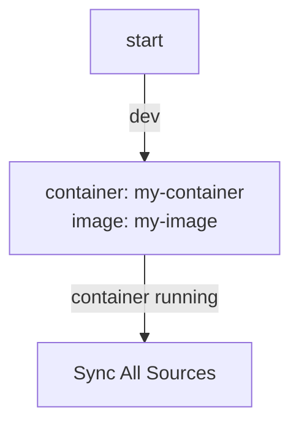

```mermaid
graph TB
my-container["container: my-container<br/>image: my-image"]
start["start"]
sync-all-my-container["Sync All Sources"]
start -->|"dev"| my-container
my-container -->|"container running"| sync-all-my-container
```
