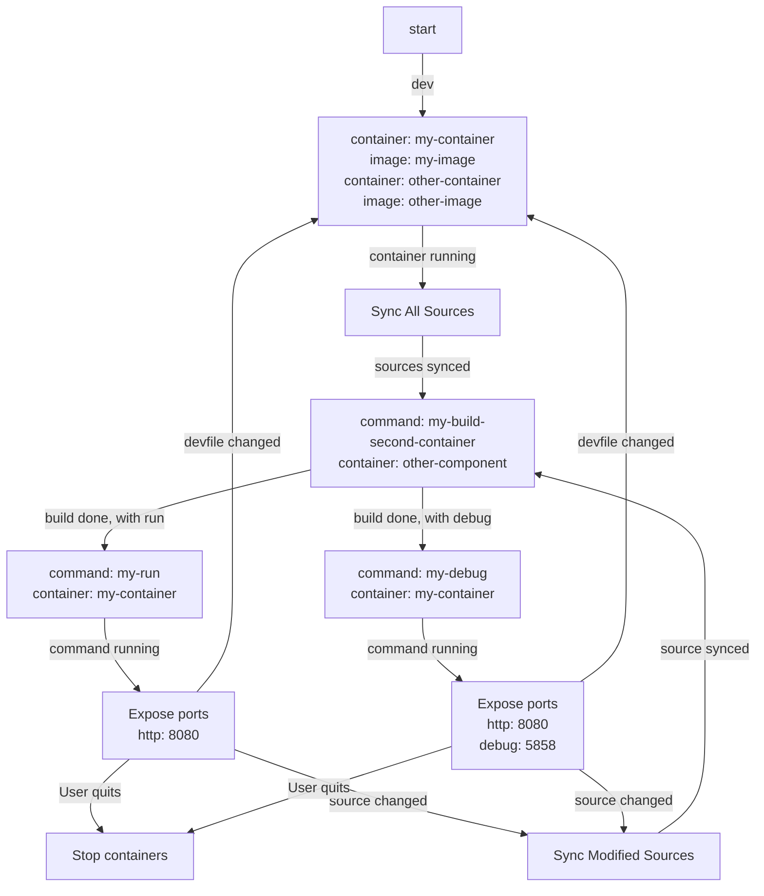

```mermaid
graph TB
containers["container: my-container<br/>image: my-image<br/>container: other-container<br/>image: other-image"]
containers-my-debug-expose["Expose ports<br/>http: 8080<br/>debug: 5858"]
containers-my-run-expose["Expose ports<br/>http: 8080"]
containers-stop["Stop containers"]
my-build-second-container["command: my-build-second-container<br/>container: other-component"]
my-debug["command: my-debug<br/>container: my-container"]
my-run["command: my-run<br/>container: my-container"]
start["start"]
sync-all-containers["Sync All Sources"]
sync-modified-containers["Sync Modified Sources"]
start -->|"dev"| containers
containers -->|"container running"| sync-all-containers
sync-all-containers -->|"sources synced"| my-build-second-container
my-build-second-container -->|"build done, with run"| my-run
my-run -->|"command running"| containers-my-run-expose
containers-my-run-expose -->|"User quits"| containers-stop
containers-my-run-expose -->|"source changed"| sync-modified-containers
sync-modified-containers -->|"source synced"| my-build-second-container
containers-my-run-expose -->|"devfile changed"| containers
my-build-second-container -->|"build done, with debug"| my-debug
my-debug -->|"command running"| containers-my-debug-expose
containers-my-debug-expose -->|"User quits"| containers-stop
containers-my-debug-expose -->|"source changed"| sync-modified-containers
containers-my-debug-expose -->|"devfile changed"| containers
```
